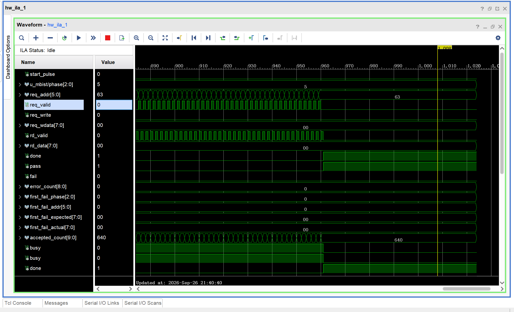
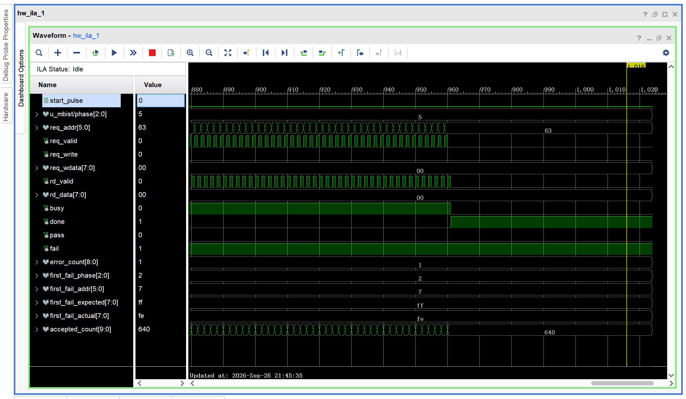

# Project 3 — RTL MBIST with Fault Coverage and FPGA / ASIC Verification

This project implements a 64×8 March C− memory built-in self-test controller. An independent transaction checker verifies access order and first-failure diagnostics, fault models evaluate detection, and FPGA tests cover start, reset, PASS/FAIL, and repeated runs. The ASIC branch reuses the controller for Nangate45 standard-cell synthesis, gate-level functional verification, and synthesis-stage area and timing analysis.

## Hardware and tools

| Item | Configuration |
| --- | --- |
| FPGA | Da Vinci V2.1, Artix-7 XC7A35TFGG484-2I, 50 MHz |
| Memory | 64×8, single port, one-cycle synchronous read |
| Development and simulation | Verilog / SystemVerilog, Vivado / XSim 2018.3, Icarus Verilog, Python |
| ASIC | WSL2 / Ubuntu 24.04, Docker, ORFS, Yosys, OpenROAD/OpenSTA |
| Process and constraints | Nangate45 typical, 25 °C / 1.10 V, 20 ns clock period |

Tool configuration, the pinned container image, and commands are in the [reproduction guide](docs/reproduce.md).

## Highlights

- **RTL architecture:** Modular March C− MBIST controller for 64×8 synchronous memory, executing 640 read/write requests with first-failure diagnostics.
- **Independent verification and fault coverage:** External transaction checker and automated XSim/Icarus campaign, detecting all 2,048 instances across four defined single-fault models.
- **FPGA implementation and validation:** Artix-7 implementation meeting 50 MHz timing, with five ILA captures verifying complete test sequences and controlled-failure diagnostics.
- **ASIC synthesis and verification:** Nangate45 standard-cell synthesis, dual-simulator gate-level regression, and pre-placement timing analysis; 264 cells, 483.322 µm² total cell area, and +17.3953 ns setup WNS.

## System design

March C− executes `M0 ↑(w0)`, `M1 ↑(r0,w1)`, `M2 ↑(r1,w0)`, `M3 ↓(r0,w1)`, `M4 ↓(r1,w0)`, and `M5 ↑(r0)`, using data patterns `00` and `FF`. Each run comprises 640 requests: 320 reads and 320 writes. A read comparison completes before the write to the same address. The test continues after an error, counting failed comparisons and retaining the first-failure phase, address, expected value, and actual value.

```text
                            Shared MBIST controller
clk / rst_n / start → March FSM + address/data generators → Request interface
                              ↑                                  ↓
Results and first-failure ← Response checker ← Read response   External memory
diagnostics

FPGA: board_top + synchronous BRAM + buttons/LEDs/optional ILA
ASIC: mbist_asic_top + shared controller; SRAM is outside the synthesis boundary
Simulation: independent transaction checker + normal/faulty RAM + fault reference monitor
```

The shared controller entry is `rtl/mbist_top.v`. The default FPGA configuration is the normal v9 build of `fpga/board_top.v`. The ASIC entry is `asic/rtl/mbist_asic_top.v`, with seven synthesis files listed in `asic/rtl/asic_rtl.f`. Both top levels share the controller implementation; FPGA measurements and ASIC synthesis experiments are reported separately.

## Version history

| Version | Implementation and verification |
| --- | --- |
| [v1 Specification](docs/01_memory_march_spec.md) | Fixed interface, one-cycle synchronous read, and 640-request reference sequence |
| [v2 RAM](docs/02_ram_verification.md) | Normal synchronous RAM; 146 checks passed in each simulator |
| [v3 Controller](docs/03_mbist_rtl_verification.md) | March FSM, address/data generators, response checker, and first-failure capture |
| [v4 Independent verification](docs/04_independent_verification.md) | External transaction checker; six categories of single-change RTL errors detected |
| [v5 Fault models](docs/05_faulty_memory_model.md) | Four single-fault RAM models and independent reference model; 28 directed runs passed |
| [v6 Fault campaign](docs/06_automated_fault_campaign.md) | Dual-simulator regression of 2,048 unique instances and single-case replay |
| [v7 Coverage](docs/07_fault_coverage_evaluation.md) | Per-instance detection statistics, first-detection phases, and exceptions |
| [v8 FPGA implementation](docs/08_fpga_implementation.md) | Board wrapper, BRAM, 50 MHz place and route, bitstreams, and ILA |
| [v9 Board verification](docs/09_engineering_review.md) | Reset, repeated start, normal/controlled-failure runs, and five ILA capture checks |
| [v10 ASIC architecture](docs/10_asic_architecture.md) | Pass-through top level around the shared controller; 32 dual-simulator runs comparing original and ASIC tops |
| [v11 Configuration and constraints](docs/11_asic_constraints.md) | Nangate45 configuration, 20 ns SDC, and external interface budgets based on v10 |
| [v12 Synthesis and netlist verification](docs/12_asic_synthesis.md) | Standard-cell netlist generated with v11 configuration; 16 directed gate-level scenarios passed across both simulators |
| [v13 Area and timing](docs/13_synthesis_evaluation.md) | Area reconciliation and STA using the verified v12 netlist, v11 SDC, and the same library |

v1–v9 cover specification, verification, and FPGA development. v10–v13 form the ASIC branch, reusing the controller and v4/v5 verification environment. Implementation issues and fixes are recorded in the [development log](docs/DEVLOG.md).

## Measurements and verification

The independent checker obtains expected transactions from a frozen CSV without reading the controller FSM. It checks request order, addresses, write data, read responses, completion timing, and first-failure diagnostics. Error injection tests the checker's decisions. The fault campaign uses four single-fault behavior models, with one faulty bit at one address per instance.

| Fault type | Instances / confirmed detections across both tools | First-detection phase |
| --- | ---: | --- |
| SA0 | 512 / 512 | M2 |
| SA1 | 512 / 512 | M1 |
| Rising transition fault | 512 / 512 | M2 |
| Falling transition fault | 512 / 512 | M3 |

All 2,048 unique instances were detected. The two simulators produced 4,096 valid records, with no unactivated instances, invalid records, or disagreements. This coverage applies to the simulated fault set above. Raw data and statistics are indexed in the [v7 results](results/step07/README.md).

### FPGA implementation and board runs

| Build | LUTs | Registers | RAMB18 / RAMB36 | WNS / WHS (ns) |
| --- | ---: | ---: | --- | --- |
| Normal, no ILA | 98 | 63 | 1 / 0 | +14.474 / +0.121 |
| Normal, with ILA | 1,930 | 2,934 | 2 / 2 | +13.458 / +0.036 |
| Perturbed, no ILA | 112 | 73 | 1 / 0 | +15.085 / +0.130 |
| Perturbed, with ILA | 1,941 | 2,944 | 2 / 2 | +13.031 / +0.062 |

All four builds meet setup and hold timing at 50 MHz. Resource counts include the board wrapper and corresponding debug logic. Detailed results are in the [implementation report index](results/reruns/20260926_review_final/README.md).

Three normal board runs returned PASS, and two runs with a controlled read-response perturbation returned FAIL. Every ILA capture was checked against all 640 requests. Both failure runs reported M2, address 7, expected FF, actual FE, and one error, then continued to DONE. Reset and restart results, board photos, and native ILA captures are in the [board records](results/step08/hardware_final/README.md).





### ASIC synthesis results

| Metric | v13 result |
| --- | --- |
| Standard cells / DFFs / combinational cells | 264 / 42 / 222 |
| Total / sequential / combinational area | 483.322 / 189.924 / 293.398 µm² |
| Clock period / Setup WNS | 20 ns / +17.3953 ns |
| Worst setup path | `rd_data[7]` → D pin of the `first_fail_actual[5]` register |
| Arrival time / external input delay / internal path delay | 2.3656 / 2.0000 / 0.3656 ns |
| `check_setup` diagnostics / unconstrained path groups | 0 / 0 |

The v12 netlist passed normal and directed fault regressions using zero-delay standard-cell functional models, completing 640 requests per run. v13 area is the sum of Liberty cell instance areas. STA uses the `5K_hvratio_1_1` wire-load model and ideal clocks, providing a pre-placement estimate. Raw reports and path analysis are in the [v13 evaluation](docs/13_synthesis_evaluation.md).

## Reflections

One useful lesson came from the FPGA reset path. The first implementation met the clock constraint, but Vivado still reported a BRAM asynchronous-control warning. Revising the reset synchronization removed the warning; later CDC checks prompted a further refinement of the release path. This made reset behavior an explicit part of my verification work, alongside the March sequence and transaction counts.

I kept the transaction checker independent of the controller FSM so that it could catch mistakes in the implementation without relying on the same state transitions. Testing it against deliberately modified RTL helped establish which errors were observable at the interface. I also chose to continue testing after a mismatch while retaining the first failure, allowing each run to check the complete sequence and still provide a useful diagnostic.

For the ASIC extension, I preserved that interface and verified the mapped netlist before evaluating area and timing. The next improvement I would prioritize is broader testing of memory backpressure and response latency. I would then compare the current timing estimates with placement-and-routing results, using constraints derived from a specific SRAM interface.

## Reproduction and project index

| Directory | Contents |
| --- | --- |
| `rtl/`, `tb/`, `specs/` | Shared controller, RAM, checker, fault models, and reference sequence |
| `scripts/`, `sim/` | Simulation, fault campaign, coverage analysis, and ILA checks |
| `fpga/`, [releases/](releases/README.md) | Board top level, constraints, Vivado project, tested bitstreams, and probes |
| `asic/` | ASIC top level, ORFS/SDC configuration, simulation and STA scripts, RTL viewing project |
| `docs/` | Version reports, development log, and reproduction commands |
| `results/` | Original logs, reports, and captures organized by version and run ID |
| [evidence/](evidence/README.md) | Historical source required to reproduce experiments |

The [repository contents](REPOSITORY_CONTENTS.md) describe the source, retained evidence, and generated files. Copy [toolchain.example.json](toolchain.example.json) to `toolchain.local.json` and adjust installation paths, or set the tool environment variables described in the [reproduction guide](docs/reproduce.md).

Run commands from the project root, for example:

```powershell
$env:MBIST_RUN_ID = 'local_check_01'
py -3 scripts/run_basic_sim.py
py -3 asic/scripts/run_v10.py --tool both --run-id rtl_check_01
```

FPGA builds, gate-level simulation, WSL synthesis, and STA commands are collected in the [reproduction guide](docs/reproduce.md). Use a new run ID each time. Caches go to `.build/`; results go to the corresponding experiment directory.

Reference projects: [MBIST March Algorithms](https://github.com/Happy251005/mbist-march-algorithms), [Politecnico di Torino Memory BIST](https://github.com/cad-polito-it/memory-bist), and [SRAM Controller UVM Verification](https://github.com/abdo-ehab-euv/sram-controller-uvm-verification). Coupling faults, March X, and MBIST place and route have not been implemented.
