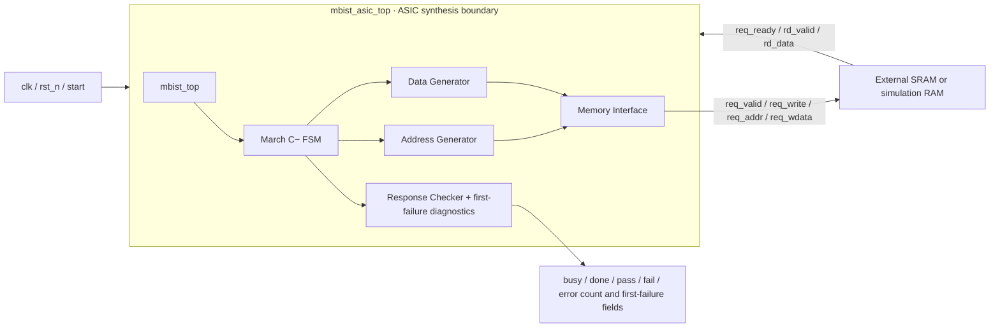
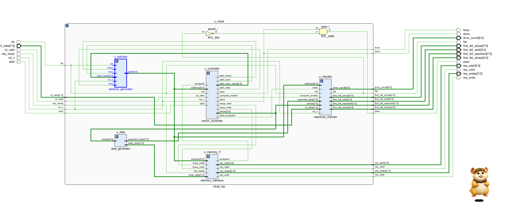
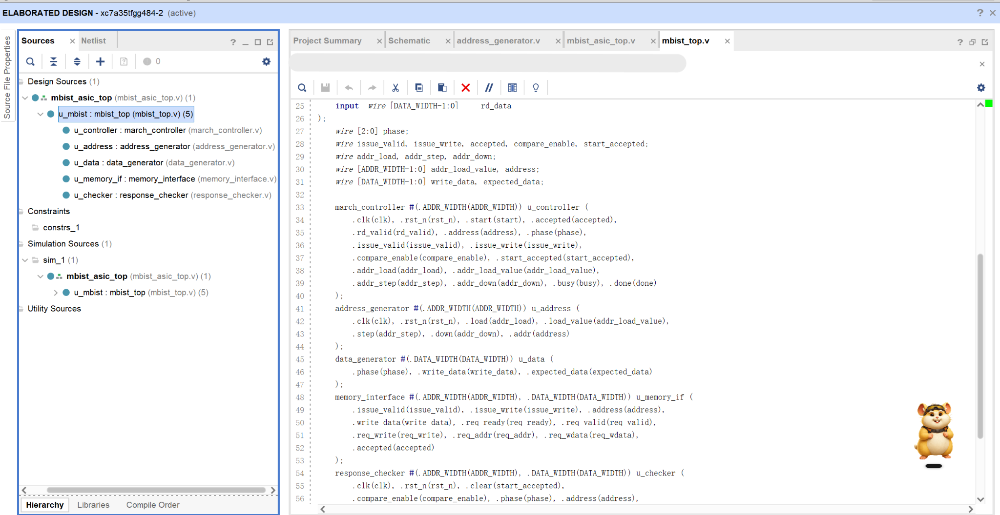
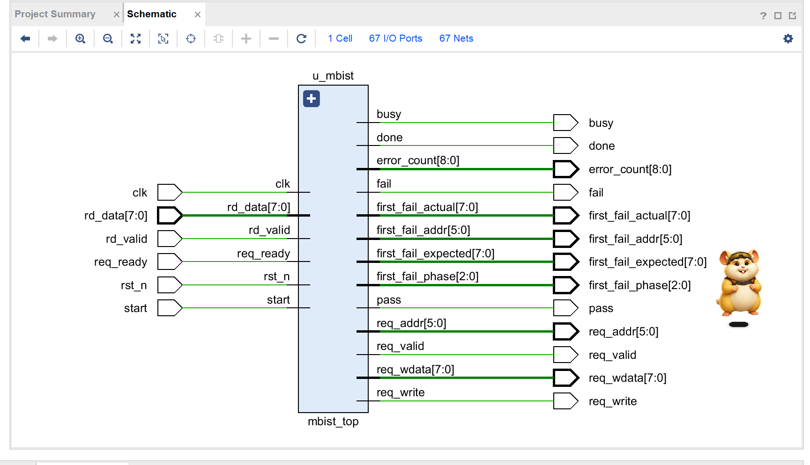

# V10 · ASIC-Oriented MBIST Architecture Design

Status: architecture adaptation passed. This version adapts the synthesis boundary of the 64×8 March C− controller for ASIC use. Standard-cell mapping, SDC, area, and timing are covered in V11–V13.

## Architecture

[`mbist_asic_top.v`](../asic/rtl/mbist_asic_top.v) provides a stand-alone controller top level. It instantiates the verified [`mbist_top.v`](../rtl/mbist_top.v) without changing the March FSM, address generation, data patterns, response comparison, or first-failure diagnostics. The controller receives `clk/rst_n/start` and connects to external memory through request and read-response ports. SRAM itself is outside ASIC synthesis.



The submodules come from the original `rtl/`: `march_controller`, `address_generator`, `data_generator`, `memory_interface`, and `response_checker`. `mbist_top` is their verified integration layer; the ASIC top passes its ports through. It has no connection to `board_top`, BRAM, buttons, LEDs, ILA, or FPGA IP. The diagram describes the architecture; the following Vivado 2018.3 schematic shows the connections elaborated from the seven V10 RTL files, including `u_controller`, `u_address`, `u_data`, `u_memory_if`, and `u_checker`.



The hierarchy and source view also show `mbist_asic_top → u_mbist →` the five functional instances, alongside their actual port connections in `mbist_top.v`:



## Top-level interface and timing contract

The acceptance configuration is `ADDR_WIDTH=6`, `DATA_WIDTH=8`, matching the 640-entry reference sequence. `rst_n` is an active-low synchronous reset sampled on the rising edge of `clk`.

| Port | Direction / width | Meaning |
| --- | --- | --- |
| `clk`, `rst_n`, `start` | Inputs, 1 bit each | 50 MHz target; reset and start controls |
| `req_valid`, `req_write` | Outputs, 1 bit each | Request valid; `req_write=1` denotes a write |
| `req_addr`, `req_wdata` | Outputs, 6 / 8 bits | Word address and write data |
| `req_ready` | Input, 1 bit | A request is accepted on the clock edge when both it and `req_valid` are 1; the request remains stable while waiting |
| `rd_valid`, `rd_data` | Inputs, 1 / 8 bits | Valid response and data for an accepted read; comparison occurs only with `rd_valid` |
| `busy`, `done`, `pass`, `fail` | Outputs, 1 bit each | Run and result status; `pass=done && !fail` |
| `error_count` | Output, 9 bits | Accumulated failed read comparisons |
| `first_fail_phase`, `first_fail_addr` | Outputs, 3 / 6 bits | First-failure phase and address |
| `first_fail_expected`, `first_fail_actual` | Outputs, 8 bits each | Expected and observed data at the first failure |

The elaborated ASIC top shows one `u_mbist` instance connected directly to 67 external I/O bits. Clock, control, and read-response inputs appear on the left; request, status, and diagnostic outputs appear on the right. No SRAM is instantiated:



A request is accepted at rising edge `E_k`. A one-cycle synchronous RAM produces the response after that edge, and the controller consumes `rd_valid/rd_data` at `E_{k+1}`. A same-address write follows receipt and comparison of the read response. Each run completes the frozen CSV's 640 requests, comprising 320 reads and 320 writes. After an error, execution continues, the first-failure fields remain fixed, and the error count may increase. An accepted `start` after DONE clears the previous diagnostics. External memory delay, load, and SDC assumptions are described in [v11](11_asic_constraints.md).

## Implementation and file boundary

[`asic_rtl.f`](../asic/rtl/asic_rtl.f) explicitly lists seven Verilog synthesis inputs: the ASIC wrapper, `mbist_top`, and five submodules. Simulation additionally connects `single_port_sync_ram.v` or `faulty_memory.sv`; neither appears in the synthesis list. The original controller source is unchanged. The v11 ORFS configuration references the same design files.

The [Vivado RTL project](../asic/vivado/mbist_asic_v10/mbist_asic_v10.xpr) uses the same seven-file list and `mbist_asic_top` as its top, for inspection through Open Elaborated Design. The [historical project audit](../results/asic/v10/vivado_view/audit.json) records fingerprints of the original project and three screenshots. The [current project audit](../results/asic/v10/projectiii_vivado/audit.json) checks the current file list, source bodies, and elaboration log. Vivado's Artix-7 selection provides a target for RTL visualization; its FPGA netlist, resource counts, and timing are not used for ASIC conclusions.

The [source comparison](../evidence/asic_integration/shared_file_comparison.json) records byte differences between shared source and the extension experiment. Historical source is retained in the [snapshot](../evidence/asic_integration/source_snapshot.zip); the current shared controller body matches it.

## Functional verification

[`run_v10.py`](../asic/scripts/run_v10.py) generates `oracle.hex` from the frozen [`march_c_minus_64x8.csv`](../specs/march_c_minus_64x8.csv). It copies the existing v4/v5 testbenches into separate build directories, archives the test copies and logs, and replaces only the unique DUT instance from `mbist_top` to `mbist_asic_top`. The checker, RAM, fault model, and reference monitor remain the original files. The script first establishes a baseline with the original top, then compiles the ASIC top and compares external checker and fault results for each case. Source fingerprints, compile/run logs, and machine-readable summaries are in the [verification records](../results/asic/v10/README.md).

| Scenario | ASIC top-level result |
| --- | --- |
| Normal run, repeated `start` while busy, then restart after DONE with one read-response perturbation | 640 requests and 960 checker-counted cycles in each run; first run PASS with 0 errors, second run FAIL with 1 error; first-failure fields checked cycle by cycle |
| Fault-free RAM | 640 requests, 0 errors, PASS |
| SA0, address 7 / bit 2 | First failure M2 / address 7 / FF→FB; 2 failed comparisons |
| SA1, address 7 / bit 2 | First failure M1 / address 7 / 00→04; 3 failed comparisons |
| Rising transition fault, address 7 / bit 2 | First failure M2 / address 7 / FF→FB; 2 failed comparisons |
| Falling transition fault, address 7 / bit 2 | First failure M3 / address 7 / 00→04; 2 failed comparisons |
| SA0, address 63 / bit 7; falling transition fault, address 0 / bit 0 | Both complete 640 requests; first-failure addresses are 63 and 0 respectively, matching the original top's diagnostics |

Icarus Verilog 11.0 (devel) and Vivado XSim 2018.3 each ran eight scenarios on both the original and ASIC tops, totaling 32 simulations. The eight ASIC results agree across tools. The existing independent checker validates each address, direction, write value, response consumption, completion time, error count, and first-failure record. The v5 testbench also checks activation, first-failure values, and final status. A separate top-level compile with `iverilog -g2012 -Wall -s mbist_asic_top -f asic/rtl/asic_rtl.f` exited with code 0 and no diagnostics. Vivado's [elaboration log](../results/asic/v10/vivado_view/elaboration.log) confirms that all seven controller modules were parsed, with 0 warnings and 0 errors. Screenshots show the hierarchy and interface; functional acceptance is determined by the independent checker. See the [run index](../results/asic/v10/README.md).

This directed regression reused seven verified fault configurations rather than repeating the full 2,048-instance campaign; the wrapper does not introduce a new coverage calculation. Synchronous-reset checks cover reset before start and diagnostic clearing on restart. Additional cases such as reset during execution were not tested separately in this version.

## Debugging and acceptance

No RTL port-connection errors, width mismatches, or behavioral differences were found; compilation and regression passed on the first run. XSim 2018.3's Windows batch entry requires inner quotes around `NAME=VALUE` passed through `-testplusarg`, handled as in v5. The first Vivado batch attempt used `open_elaborated_design`, which is unavailable as a Tcl command in this version; the error is retained in the [creation log](../results/asic/v10/vivado_view/create_project.log). Switching to `synth_design -rtl -name rtl_1` produced successful elaboration, recorded in the [successful log](../results/asic/v10/vivado_view/elaboration.log). The regression did not overwrite existing `results/stepXX` records.

Acceptance: the top compiles; the synthesis list contains only the controller; Vivado elaborates the correct hierarchy and five functional modules, with interface/hierarchy screenshots saved; and the ASIC top passes independent checks for normal, perturbed, and directed fault cases, matching the original top's external behavior. V10 is complete.

Run from the project root with Icarus and XSim installed:

```powershell
py -3 asic/scripts/run_v10.py --tool icarus --run-id rtl_icarus_01
py -3 asic/scripts/run_v10.py --tool xsim --run-id rtl_xsim_01
```

Use a new run ID each time. Outputs are written to `results/asic/v10/<run_id>/`.

Instructions for the Vivado project and screenshots are in the [visual evidence index](../results/asic/v10/vivado_view/README.md).
