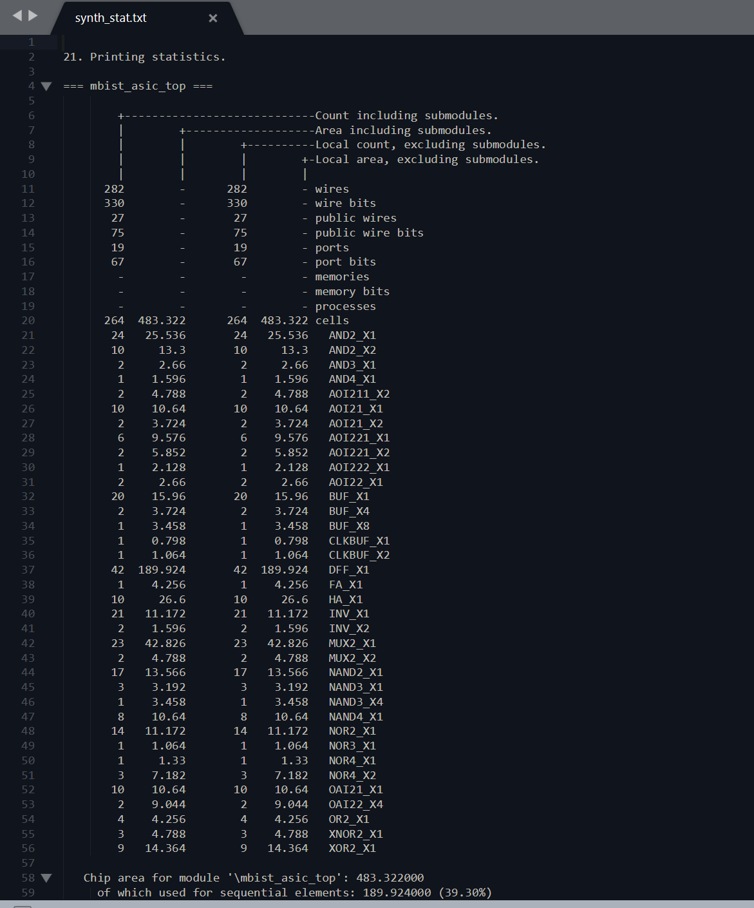
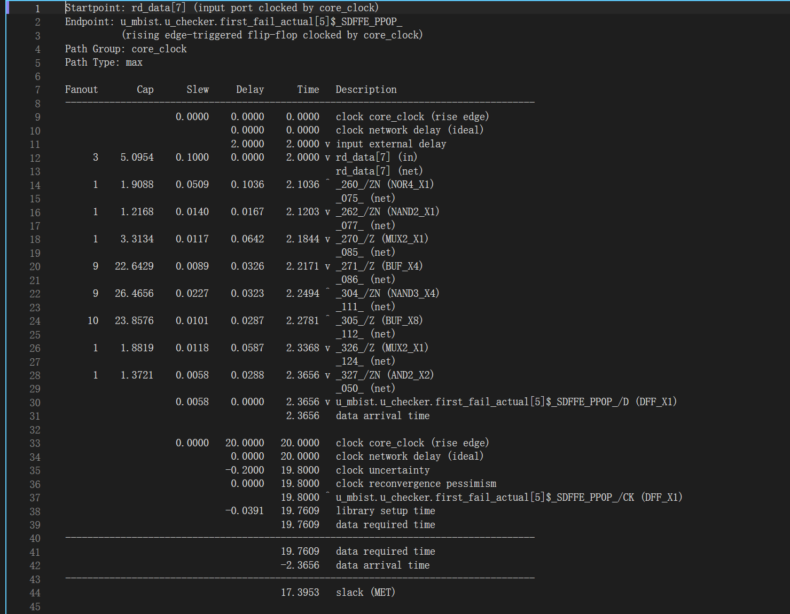

# V13 · Synthesis Area & Timing Evaluation

Status: PASS; the Phase I synthesis-evaluation baseline is frozen. Area and timing analysis uses the same controller standard-cell netlist that passed V12's independent gate-level checker. V13 changes neither March C− RTL nor V11 SDC and does not repeat V12 functional regression. Original reports, screenshots, and cross-checks are in the [evidence index](../results/asic/v13/README.md) and [`final_audit.json`](../results/asic/v13/20260927_v13_readout/final_audit.json).

## V13.1 Frozen evaluation inputs

The netlist is `1_2_yosys.v` from V12 run `20260927_v12_frozen`, SHA-256 `2ee12dd24b206979675817e3d92ddb97ead0b489f32ffcbacda1627bce2656c9`. Constraints are V11's `constraint.sdc`, SHA-256 `25d0335d58513c8277ee01128db96be66b87af1cec928a72effc459a48bbc494`. Nangate45 typical Liberty has SHA-256 `8d540a4d4cf6d09d27c87ad067857a9c0c2eeb023ab7a56e058cd3113db4e9b1`. The [preflight audit](../results/asic/v13/20260927_v13_readout/preflight.json) checks these fingerprints, the V12 16/16 gate-level results, and the structure report. ORFS commit is `b74a7293ea57fc4154a08471bcf78042ed497e4e`; the container is pinned to `openroad/orfs@sha256:bc05b68ef2f023cb49d4a7f80b021d3895328c0e4ee8491ae9bdf6fc29771b9f`. OpenROAD `-version` reports `unknown` in this image, so the image digest and ORFS commit identify the tool environment.

The target clock is 20 ns, with setup/hold uncertainty of 0.2/0.1 ns. Non-clock input min/max delays are 0/2 ns and input transition is 0.1 ns. Output min/max delays are 0/2 ns, with 4 fF load. Active-low `rst_n` is synchronous and remains timed. Nangate45 conditions are typical, 25 °C, 1.10 V, process 1.00; time and load units are ns and fF. SRAM is external to the controller, and interface budgets must be confirmed during actual SRAM/SoC integration.

## V13.2 Standard-cell area

Cell-type counts and areas are extracted from the [original Yosys statistics](../results/asic/v13/20260927_v13_readout/input_snapshot/synth_stat.txt). The [audit script](../asic/scripts/audit_v13.py) recomputes area from frozen Liberty cell areas and compares it with Nangate45 LEF dimensions and the V12 structure inventory. Per-cell data is in [`area_cells.csv`](../results/asic/v13/20260927_v13_readout/area_cells.csv) and [`area_summary.json`](../results/asic/v13/20260927_v13_readout/area_summary.json).

| Metric | Result |
| --- | ---: |
| Standard-cell count | 264 |
| DFF / sequential count | 42 |
| Combinational count | 222 |
| Standard-cell area | 483.322 µm² |
| Sequential area | 189.924 µm² (39.30%) |
| Combinational area | 293.398 µm² (60.70%) |

42 + 222 = 264, and 189.924 + 293.398 = 483.322 µm². Liberty area multiplied by instance count agrees with Yosys for every cell type; LEF dimensions also match. This is the sum of controller standard-cell instance areas, excluding SRAM, I/O pads, routing, whitespace, and die area.

## V13.3 Synthesis-stage STA

[`report_v13.tcl`](../asic/scripts/report_v13.tcl) loads the frozen netlist, Liberty, LEF, and SDC directly into OpenROAD/OpenSTA. With no placement or SPEF, interconnect is estimated using the Nangate45 Liberty `5K_hvratio_1_1` wire-load model in `top` mode. The clock network is ideal. The [tool log](../results/asic/v13/20260927_v13_readout/sta.log) records one clock, 13 input bits including the clock, 54 output bits, and 42 registers. `check_setup.rpt` contains no diagnostics, and unconstrained-path JSON contains no `unconstrained` path group. The text from `report_checks -unconstrained` also lists the normally constrained `core_clock` group, so omissions are judged using JSON `path_group`.

| Metric | Result and source |
| --- | --- |
| Target clock | 20.0000 ns, V11 SDC |
| Setup WNS | +17.3953 ns, [`setup_wns.rpt`](../results/asic/v13/20260927_v13_readout/sta/setup_wns.rpt) |
| Worst path type | Input → register, first path in [`setup_top10.rpt`](../results/asic/v13/20260927_v13_readout/sta/setup_top10.rpt) |
| Startpoint | `rd_data[7]` |
| Endpoint | `u_mbist.u_checker.first_fail_actual[5]$_SDFFE_PP0P_/D` |
| External input delay | 2.0000 ns |
| Data arrival | 2.3656 ns |
| Controller data-path delay | 0.3656 ns (2.3656 − 2.0000, including wire-load-based interconnect estimation) |
| Data required | 19.7609 ns |
| Setup slack | 19.7609 − 2.3656 = +17.3953 ns, MET |
| Setup diagnostics / unconstrained path groups | 0 / 0 |

The worst path starts at read-response input `rd_data[7]`, passes through NOR4, NAND2, multiplexers, buffers, and other combinational gates, and ends at the DFF for first-failure diagnostic data `first_fail_actual[5]`. It corresponds to response comparison and first-failure data capture. The first 2.0000 ns of the 2.3656 ns arrival time is the external input budget and is not controller delay. `20 ns − WNS` likewise cannot directly establish maximum internal combinational delay or maximum operating frequency.

The [register-to-register report](../results/asic/v13/20260927_v13_readout/sta/reg_to_reg.rpt) gives 0.5270 ns arrival and +19.2331 ns slack from March phase register `phase[1]` to address register `addr[4]`. The [register-to-output report](../results/asic/v13/20260927_v13_readout/sta/reg_to_output.rpt) gives 0.2888 ns arrival and +17.5112 ns slack from `phase[0]` to `req_wdata[1]`, under a 2 ns output budget. These paths correspond to address progression control and write-data generation. Full path categories and screenshots are in the [image index](../results/asic/v13/README.md#screenshots).

## V13.4 Checks, debugging, and conclusions

[`audit_v13.py`](../asic/scripts/audit_v13.py) checks frozen inputs, per-cell area, the relationship between WNS and critical-path times, and constraint-check results. The original experiment's [`final_audit.json`](../results/asic/v13/20260927_v13_readout/final_audit.json) retains its numerical and screenshot checks. `04_sta_audit_snapshot.png` shows the report-generation interface; conclusions use original timing reports and numerical reconciliation.

During implementation, `report_checks -unconstrained` text was found to include constrained paths. The check therefore combines JSON path groups with an empty `check_setup.rpt`. Area checks also reconcile individual Liberty areas with LEF dimensions. Investigation and rechecks are recorded in [`DEVLOG.md`](DEVLOG.md).

To reproduce, run `bash asic/scripts/run_v13.sh NEW_RUN_ID` from the project root in Ubuntu WSL. Each new run saves separate reports and numerical checks without reusing historical screenshots. Original screenshots remain in `20260927_v13_readout/screenshots/` as evidence for that frozen run.

Phase I result: under frozen Nangate45 typical conditions, 20 ns interface constraints, and the wire-load model, controller area is 483.322 µm² and Setup WNS is +17.3953 ns. Area can be recomputed per cell, the critical path maps to first-failure diagnostics, and no omitted timing path groups were found. These are post-synthesis, pre-placement estimates rather than physical sign-off results with extracted parasitics. The V12 netlist, V11 SDC, and this evaluation provide the fixed baseline for subsequent V14–V18 work.
